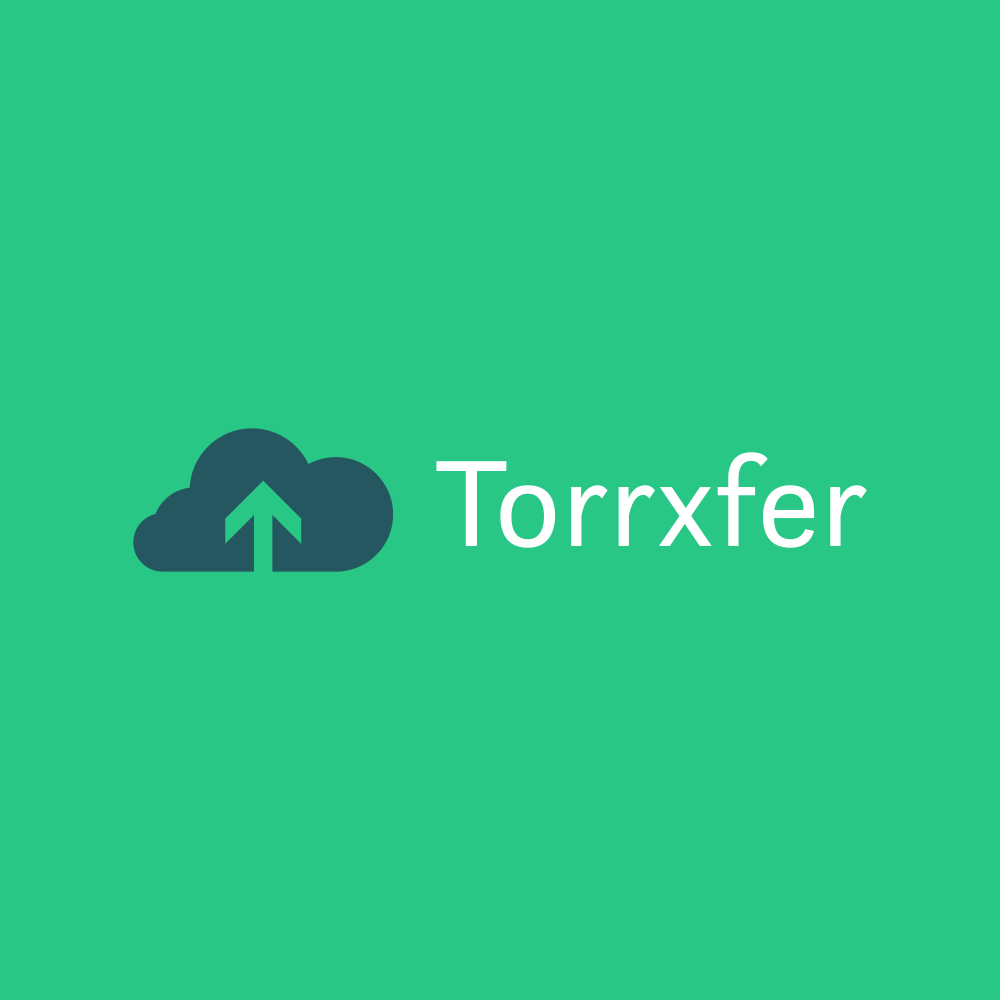

[![Contributors][contributors-shield]][contributors-url]
[![Forks][forks-shield]][forks-url]
[![Stargazers][stars-shield]][stars-url]
[![Issues][issues-shield]][issues-url]
[![MIT License][license-shield]][license-url]
[![LinkedIn][linkedin-shield]][linkedin-url]


<!-- PROJECT LOGO -->
<br />
<p align="center">
  <a href="https://github.com/sushshring/torrxfer">
    
  </a>

  <h3 align="center">Torrxfer Client/Server</h3>

  <p align="center">
    A simple directory scanner client and hosting server to copy/move torrent downloads
    <br />
    <a href="https://pkg.go.dev/github.com/sushshring/torrxfer"><strong>Explore the docs »</strong></a>
    <br />
    <a href="https://github.com/sushshring/torrxfer/issues">Report Bug</a>
    ·
    <a href="https://github.com/sushshring/torrxfer/issues">Request Feature</a>
  </p>
</p>


<!-- TABLE OF CONTENTS -->
<details open="open">
  <summary><h2 style="display: inline-block">Table of Contents</h2></summary>
  <ol>
    <li>
      <a href="#about-the-project">About The Project</a>
      <ul>
        <li><a href="#built-with">Built With</a></li>
      </ul>
    </li>
    <li>
      <a href="#getting-started">Getting Started</a>
      <ul>
        <li><a href="#prerequisites">Prerequisites</a></li>
        <li><a href="#installation">Installation</a></li>
      </ul>
    </li>
    <li><a href="#usage">Usage</a></li>
    <li><a href="#roadmap">Roadmap</a></li>
    <li><a href="#contributing">Contributing</a></li>
    <li><a href="#license">License</a></li>
    <li><a href="#contact">Contact</a></li>
    <li><a href="#acknowledgements">Acknowledgements</a></li>
  </ol>
</details>


<!-- ABOUT THE PROJECT -->
## About The Project


### Built With

* [Golang](https://golang.org)
* [gRPC](https://grpc.io)

<!-- GETTING STARTED -->
# Getting Started

To get a local copy up and running follow these simple steps.

## Prerequisites

This is an example of how to list things you need to use the software and how to install them.
* [Golang installation](https://golang.org/doc/install)
* [Protobuf Compiler](https://grpc.io/docs/protoc-installation/)
  * If you run make, it will automatically install v3.15.5 of protoc

## Installation

1. Clone the repo
   ```sh
   git clone https://github.com/sushshring/torrxfer.git
   ```
2. Download dependencies
   ```sh
   make vendor
   ```
3. Compile Torrxfer
    ```sh
    make torrxfer-server
    make torrxfer-client
    ```
  ### Alternately
  ```sh
  # This will run the linter, download protoc, download vendor deps, run protoc generation, and compile sources
  make
  ```

## Run tests
```sh
make test
```


<!-- USAGE EXAMPLES -->
# Usage

## Torrxfer Server
  ```sh
  #usage: torrxfer-server [<flags>]

  #Torrent downloaded file transfer server

  # Flags:
  #   --help             Show context-sensitive help (also try --help-long and --help-man).
  #   --debug            Enable debug mode
  #   --tls              Should server use TLS vs plain TCP
  #   --cafile=CAFILE    The file containing the CA root cert file
  #   --keyfile=KEYFILE  The file containing the CA root key file
  #   --version          Show application version.
  ```
  ### Debug (development) mode
  ```sh
  torrxfer-server --debug
  ```

  ### Production mode
  ```sh
  torrxfer-server --tls --cafile=</path/to/cafile> --keyfile </path/to/keyfile>
  ```

  ### Environment variables
  * `TORRXFER_SERVER_MEDIADIR`: Set the root directory to transfer files to
  * `TORRXFER_SERVER_LOGFILE`: Set the logging file to write logs to in addition to `stdout`
  * `TORRXFER_SERVER_PORT`: Set the port the server should listen on

## Torrxfer Client
  ```sh
  # usage: torrxfer-client --config=CONFIG [<flags>]

  # Torrent downloaded file transfer server

  # Flags:
  #   --help           Show context-sensitive help (also try --help-long and --help-man).
  #   --debug          Enable debug mode
  #   --config=CONFIG  Path to configuration file
  #   --version        Show application version.

  torrxfer-client --config=</path/to/config.json> [--debug]
  ```

  ### JSON Config example
  ```json
  {
    "Servers": [{
        "Address": "localhost",
        "Port": 9650,
        "Secure": false
    },{
        "Address": "server.com",
        "Port": 9650,
        "Secure": true,
        "CertFile" "/path/to/certificate-file.pem"
    }]
    "WatchedDirectories": [{
        "Directory": "/path/to/watched-directory/",
        "MediaRoot": "/path/to" // Directory must be sub-dir of MediaRoot
    }],
    "DeleteFileOnComplete": true
  }
  ```

# Advanced design
## Client
The client is a simple command-line application that runs on the source system. It watches over a number of directories and transfers its contents to the connected server(s).

### Operations
- Directory watch
    
    Provided a list of directories, the client watches them for any changes and triggers a copy to the server. If `DeleteFileOnComplete` is set, once the file is transferred it will be deleted
    ```go
    // WatchDirectory watches a provided directory for changes and returns a channel which yields filepaths
    // Currently the client does not support retroactively sending watched files to a new server connection
    // If a new server connection is made, it will only get updates for files that are created or written to
    // after the connection starts
    func (client *TorrxferClient) WatchDirectory(dirname, mediaDirectoryRoot string) error
    ```
- Server connections

    Connect to an active server
    - Library methods:
        ```go
        // Connect to a server that is listening for new file transfers
        func (client *TorrxferClient) ConnectServer(server common.ServerConnectionConfig) (*ServerConnection, error)
        ```
    - Types:
        ```go
        type ServerConnectionConfig struct {
            Address  string            `json:"Address"`
            Port     uint32            `json:"Port"`
            UseTLS   bool              `json:"Secure"`
            CertFile *x509.Certificate `json:"CertFile"`
        }

        type ClientConfig struct {
            Servers            []ServerConnectionConfig `json:"Servers"`
            WatchedDirectories []WatchedDirectory       `json:"WatchedDirectories"`
            DeleteOnComplete   bool                     `json:"DeleteFileOnComplete"`
        }

        type WatchedDirectory struct {
            Directory string `json:"Directory"`
            MediaRoot string `json:"MediaRoot"`
        }
        ```

## Server
The server works as a gRPC service and accepts connections from authenticated clients. Clients may make gRPC calls to the server to request functionality listed below. The job of the server is to accept incoming files and stage them for the media manager application.

### Operations
- Client connections
    - Service methods:
        ```rpc
        service TorrxferServer {
            rpc TransferFile(File, stream byte) returns (FileSummary) {}
            rpc QueryFile(File) returns (FileSummary) {}
        }
        ```

<!-- CONTRIBUTING -->
# Contributing

Contributions are what make the open source community such an amazing place to be learn, inspire, and create. Any contributions you make are **greatly appreciated**.

1. Fork the Project
2. Create your Feature Branch (`git checkout -b feature/AmazingFeature`)
3. Commit your Changes (`git commit -m 'Add some AmazingFeature'`)
4. Push to the Branch (`git push origin feature/AmazingFeature`)
5. Open a Pull Request


<!-- LICENSE -->
# License

Distributed under the MIT License. See `LICENSE` for more information.


<!-- CONTACT -->
# Contact

Your Name - [@sushshring](https://twitter.com/sushshring) - contact@sushshring.com

Project Link: [https://github.com/sushshring/torrxfer](https://github.com/sushshring/torrxfer)


<!-- MARKDOWN LINKS & IMAGES -->
<!-- https://www.markdownguide.org/basic-syntax/#reference-style-links -->
[contributors-shield]: https://img.shields.io/github/contributors/sushshring/torrxfer.svg?style=for-the-badge
[contributors-url]: https://github.com/sushshring/torrxfer/graphs/contributors
[forks-shield]: https://img.shields.io/github/forks/sushshring/torrxfer.svg?style=for-the-badge
[forks-url]: https://github.com/sushshring/torrxfer/network/members
[stars-shield]: https://img.shields.io/github/stars/sushshring/torrxfer.svg?style=for-the-badge
[stars-url]: https://github.com/sushshring/torrxfer/stargazers
[issues-shield]: https://img.shields.io/github/issues/sushshring/torrxfer.svg?style=for-the-badge
[issues-url]: https://github.com/sushshring/torrxfer/issues
[license-shield]: https://img.shields.io/github/license/sushshring/torrxfer.svg?style=for-the-badge
[license-url]: https://github.com/sushshring/torrxfer/blob/master/LICENSE.txt
[linkedin-shield]: https://img.shields.io/badge/-LinkedIn-black.svg?style=for-the-badge&logo=linkedin&colorB=555
[linkedin-url]: https://linkedin.com/in/sushshring